## Einführung
Ok, du hast also die benötigten Baumaterialien organisiert? Gut! Dann zeige ich dir nun, wie du das Grundgerüst deines Arcade Automaten aufziehst. Sprich alles vom Holzgestell bis zum Verkabeln der Komponennten. Solltest du bei Letzterem unsicher sein, kannst du dir das <a href="https://www.youtube.com/watch?v=dQw4w9WgXcQ" target="_blank">Tutorial zum Einrichten</a> des Automaten anschauen oder uns per <a href="https://github.com/HazDu/Arcader/issues/new?assignees=HazDu&labels=question&projects=&template=question.md&title=Question" target="_blank">GitHub issue template</a>
 für jegliche Fragen erreichen.

## 1. Grundgestell
Als erstes errichtest du das grundgestell, das mag etwas kompliziert wirken, jedoch sollte es mit der bereitgestellten Bildanleitung einfach sein.
Zusätzlich kannst du dir das Modell aus allen Winkeln auf <a href="https://sketchfab.com/3d-models/arcade-machine-wood-base-7800679fd0f54210a0e7d8027a0f3bdf" target="_blank">Sketchfab</a>
 ansehen.  
 Für den Bau noch einige Tipps:  
 -Löcher für Schrauben mit dem 2mm Bohrer vorbohren  
 -Für Verbindungen bestenfalls zwei Schrauben verwenden  

### Schritt 1:
Zu erst baust du den Rahmen, der auf dem Boden steht.
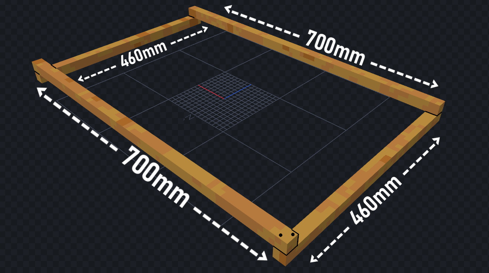

### Schritt 2:
Jetzt ziehst du den Kasten mal etwas in die Höhe. Dafür einfach in den vier Ecken die Latten festschrauben, wie im Bild zu erkennen ist. Damit hast du dann tatsächlich auch schon die Maximalhöhe des Automaten erreicht.
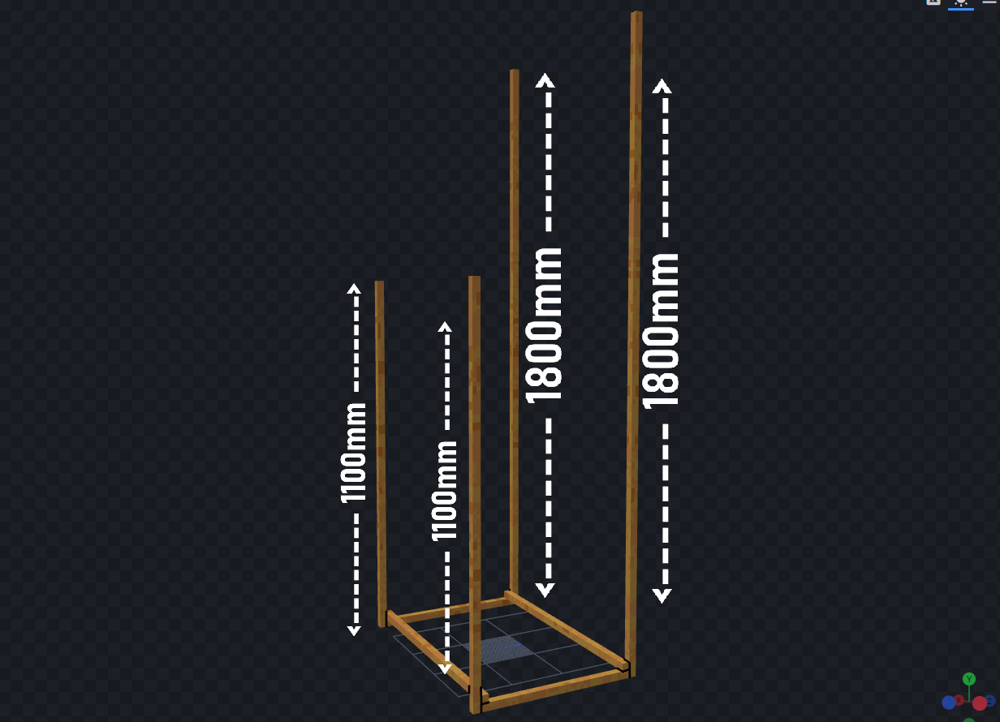

### Schritt 3:
Hier wiederholst du quasi einfach noch mal Schritt 1 nur weiter oben.
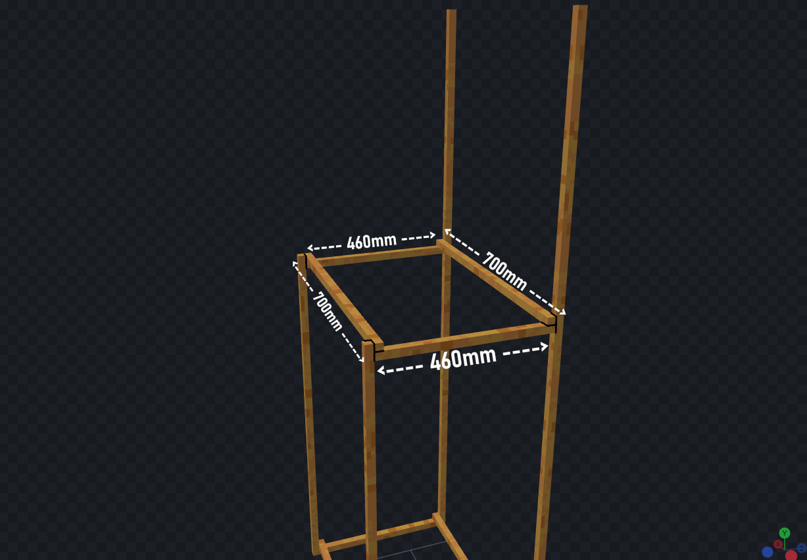

### Schritt 4:
Wenn du jetzt etwas an deinem Gestell wackelst, merkst du, dass es noch ziemlich nachgibt. Deshalb baust du jetzt einige diagonale Latten ein. Bevor du jetzt aber loslegst, scroll noch etwas nach unten und schau dir den [Tipp](https://arcader.hazdu.de/hardware/#tipp-schritt-4) an.
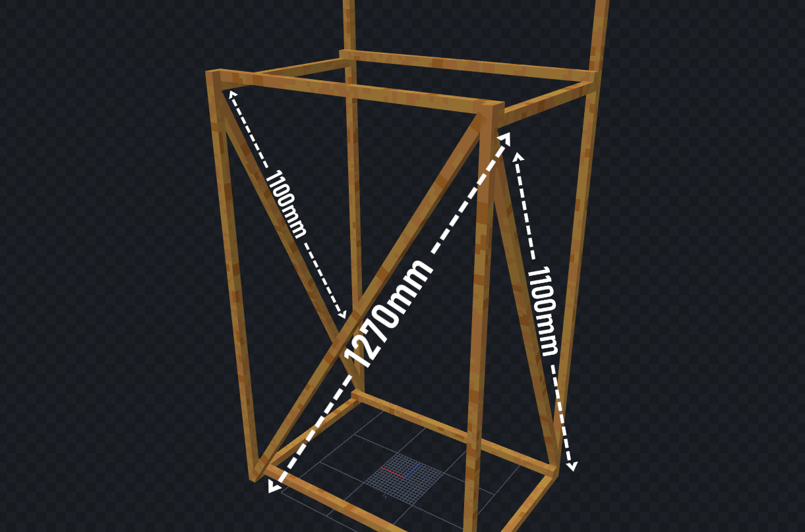
### Tipp Schritt 4:
Wenn du einen einfachen Weg brauchst, die Winkel an den Diagonalen zu messen, halte die Latte von außen an und mach innen einen Strich, genau so wie in der unteren Grafik.
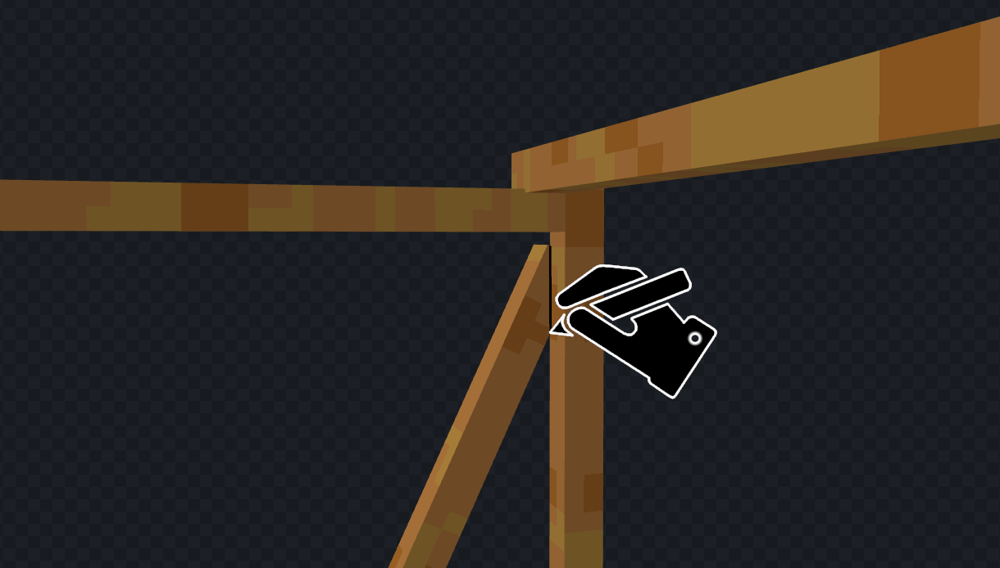

### Schritt 5:
Nun stellst du dein Gestell erst mal bei seite. Jetzt wird nämlich der obere Teil gebaut. Diesen baust du am besten zunächst einzeln zusammen, da das Ganze sonst etwas wackelig wird.
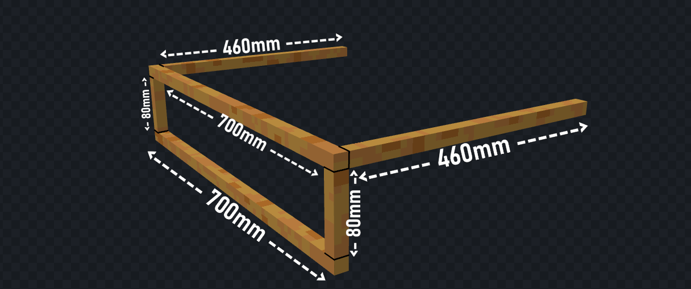

### Schritt 6:
Für den nächsten Schritt legst du das Gestell am besten auf eine der beiden Seiten. Jetzt kannst du nämlich ganz einfach den vorher gebauten Teil anschrauben, ohne diesen dauernd halten zu müssen.
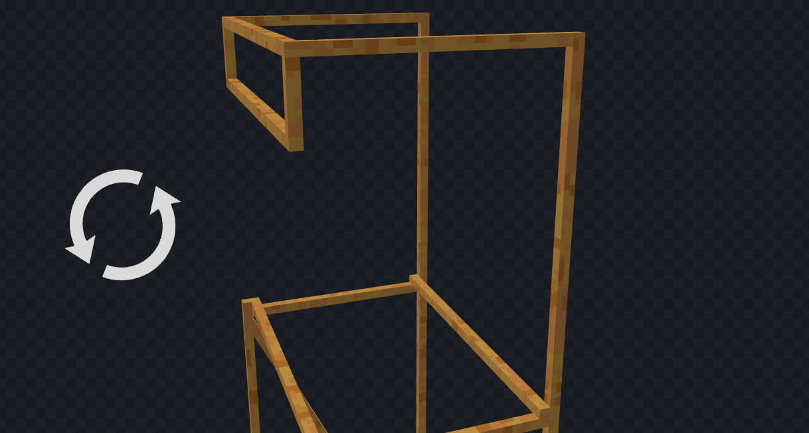

### Schritt 7:
Als nächstes verschraubst du zwei Latten diagonal über die soeben entstandenen Ecken. Hier ist der Winkel nicht allzu wichtig, in meinem Fall beträgt er circa 20°. Die Latten bringen Stabilität in den oberen Bereich und du kannst den Automaten danach wieder aufstellen.
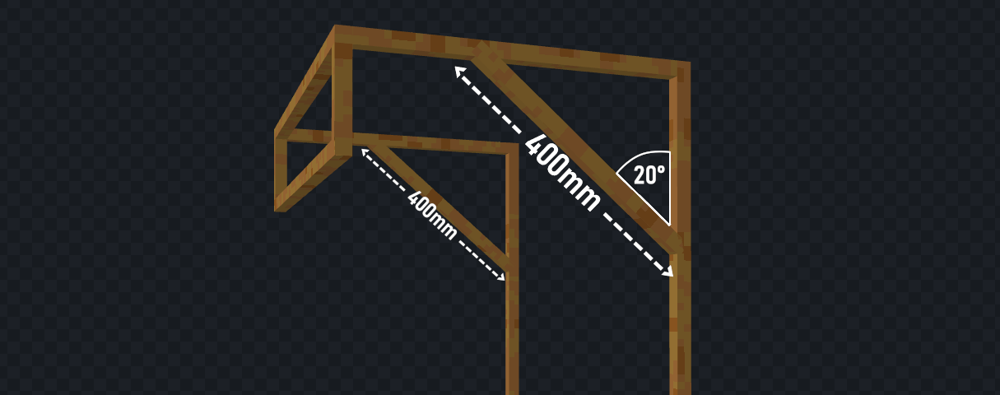

### Schritt 8:
Um das obere Gebälge zu vervollständigen, kommt hinten noch eine Querstrebe hin und zwei kurze Latten verbinden die obere Front mit den Diagonalen aus dem letzten Schritt.

### Schritt 9:
Vielleicht siehst du schon wo später das Button Panel hin kommt. Dieses ist am besten licht angeschrägt. Um dies zu erreichen, mach dir das Leben leicht, indem du einfach zwei Latten übereinander befestigst, so wie im Bild zu sehen. Die rote Markierung zeigt dir, welchen Abstand du dabei beachten musst. Aber Obacht! Auch hier gibt es wieder einen [Tipp](https://arcader.hazdu.de/hardware/#tipp-schritt-9).
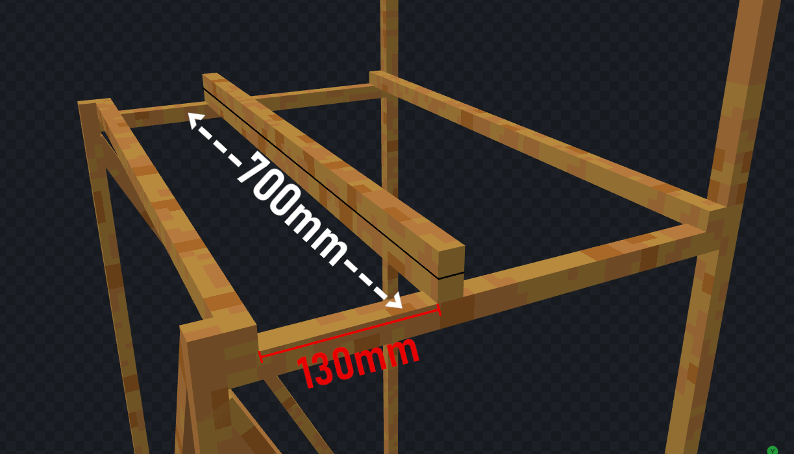
### Tipp Schritt 9:
Um sicher zu gehen ob der Abstand wirklich stimmt, kannst du zum Prüfen deine 700mm x 200mm Platte drüber legen und schauen ob sie an allen Ecken bündig aufliegt.
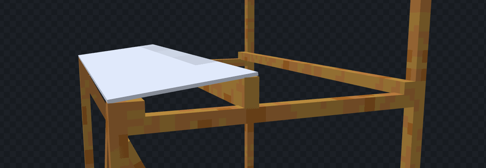

### Schritt 10:
Bisher sind die beiden Teile ja lediglich durch die zwei Latten hinten verbunden. Das änderst du jetzt! Dafür setzt du zwei Latte n wie gezeigt ein. Und für die Abschrägungen nicht vergessen, was du in [Tipp Schritt 4](https://arcader.hazdu.de/hardware/#tipp-schritt-4) gelernt hast.
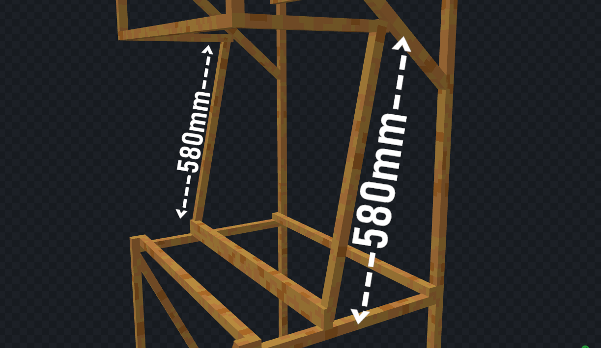

### Schritt 11:
Hier musst du jetzt etwas improvisieren, da jeder Monitor einen etwas anderen Formfaktor hat. Also allgemein brauchst du eine Halterung für den Bildschirm. Im Bild siehst du eine mögliche Lösung, welche ich gewählt habe.
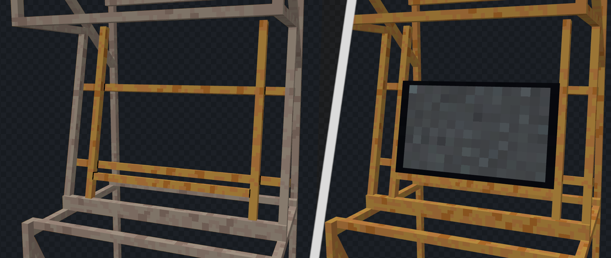

## 2. Button Panel
Als nächstes kümmerst du dich um das Button Panel Hier gibt es keine strikten Vorgaben, da du selbst entscheiden must, wie viele Buttons du für notwendig hällst und wie du sie anordnest, um sie angenehm zu drücken. Wenn du dir jedoch unsicher bist, kannst du dich an meinen Vorgaben orientieren, da sie auf dem standard Layout typischer Arcade Automaten basieren.

### Schritt 1:
Als erstes nimmst du dir deine 700mm x 200mm Hartfaserplatte, sowie den 30mm Forstnerbohrer her. Dann bohrst du die Löcher für die Buttons und noch zwei, durch die du die Joysticks stecken kannst. Beachte beim Bohren, dass der Forstnerbohrer mehr Material greift, also solltest du nicht stur durchbohren, sondern ihn alle paar Sekunden aus dem Holz holen und ca. 10 Sek. warten. Das ganze könnte zum Beispiel so aussehen:
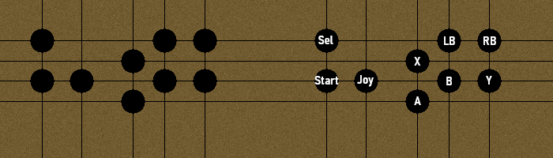

### Schritt 2:
Das Bild zeigt die Unterseite von deinem Button Panel. Halte den Joystick von unten gegen das Panel und richte ihn mittig entsprechend des Lochs aus. Dann fährst du jedes Loch in den Ecken des Joysticks nach. An den angezeichneten Stellen bohrst du jetzt durch und schraubst den Joystick fest.
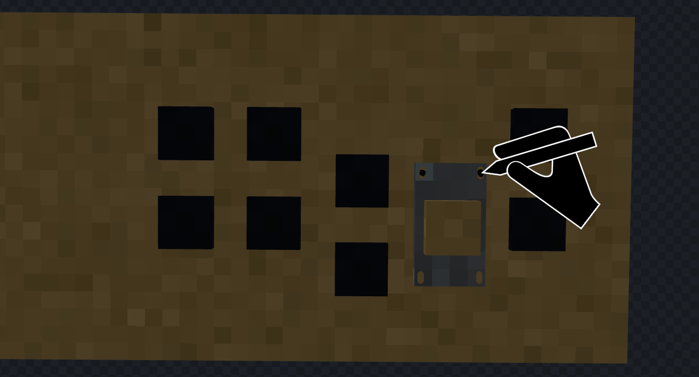

### Schritt 3:
Jetzt steckst du in die übrigen Löcher im Panel die Buttons rein und ziehst bei jedem die Plastik Mutter fest. Jetzt ist das Panel von außen fertig und sieht ca. so aus: 
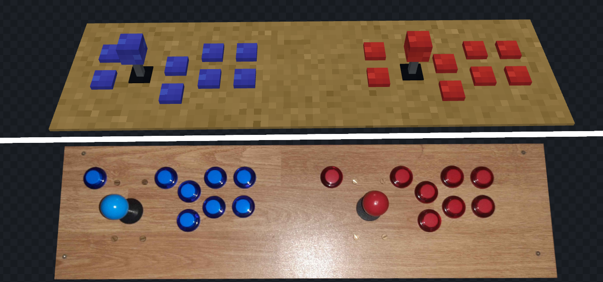

### Schritt 4:
Als letztes schraubst du einfach dein Panel an den Automaten und fertig.
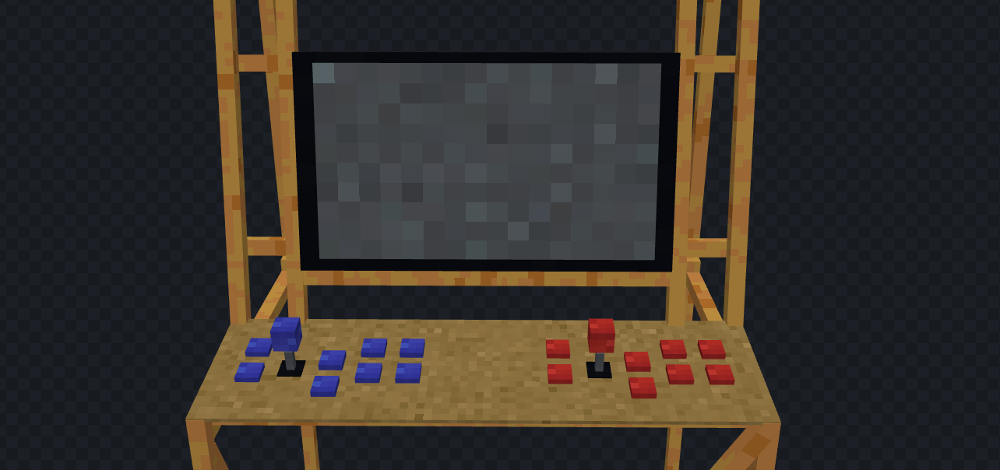

## 3. Verkleidung
In diesem Abschnitt geht es darum dein Gestell mit Platten zu verkleiden. Es kann sein, dass du hier einige Platten noch einige mm bis cm kürzen musst, nim dafür am besten ein Cutter Messer und ein Langes Lineal, eine Wasserwage oder ähnliches.

### Schritt 1:
Zum Anfang mal was leichtes, du nimmst die 700mm x 1100mm Platte. Die kommt vorne dran, damit du das Teil auch gut treten kannst, wenn du mal wieder letzter in Mariokart wirst.
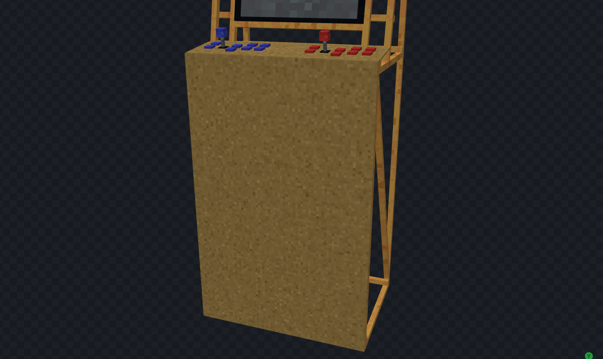

### Schritt 2:
Jetzt wirds leider doch noch mal bissel nerfig. Du musst jetzt nämlich ein mal die Ecken von deinem Bildschirm abmessen und diese auf die 700mm x 600mm Platte übertragen, das Ganze dann aussägen (Stichsäge oder Cutter) und festschrauben. Aber ich sag du schaffst das!
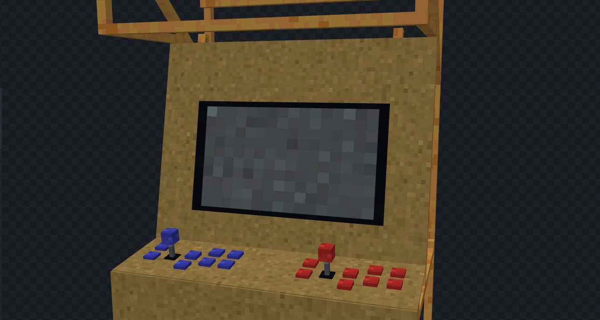

### Schritt 3:
Die nächste Platte(700mm x 300mm) geht jetzt aber wieder ganz chillig. Die bringst du jetzt wie gezeigt an:
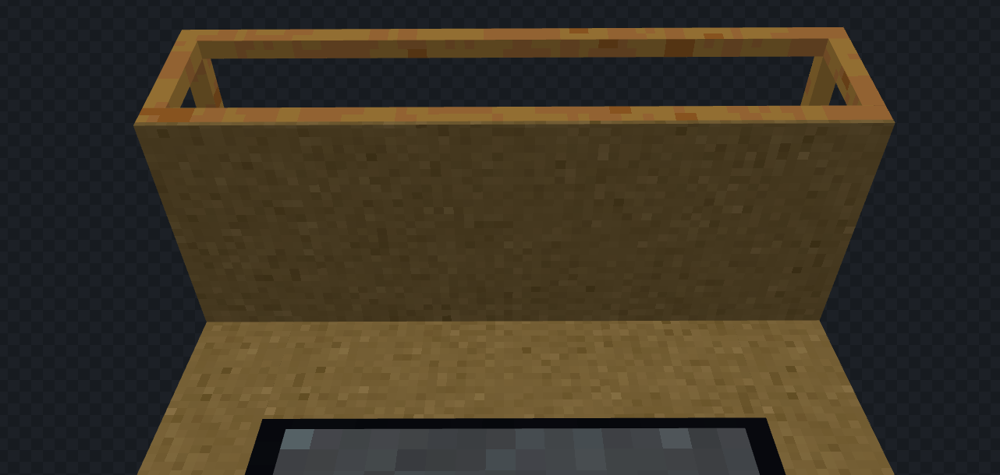

### Schritt 4:
Es ist Zeit für die Seitenwände! Lege sie erst mal an und entscheide dann wie du sie schneidest. Hier gibt es nämlich verschiedene Wege. Hier wären einige Ideen, falls dir nichts einfällt:  
(4 mögliche Wege in 4 Farben)
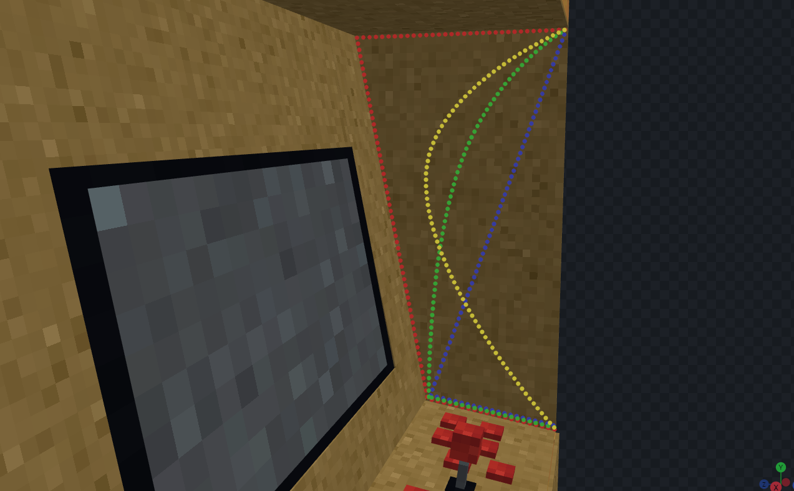

### Schritt 5:
Hast du dich entschieden? Gut, dann weißt du warscheinlich schon was kommt: festschrauben.
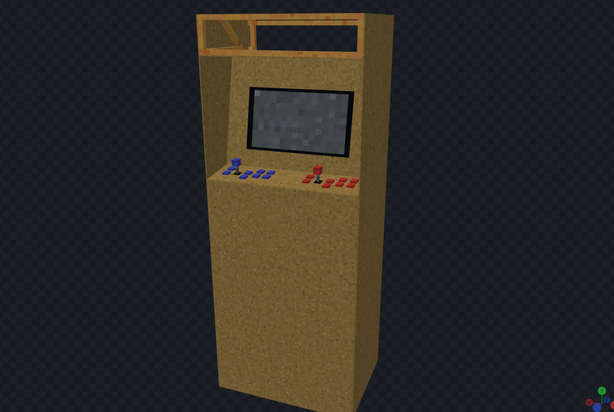

### Schritt 6:
Nun eine etwas andere Verkleidung: das LED Schild. Hier ist auch wieder deine Kreativität gefragt. Du kannst es natürlich leer lassen oder du überlegst dir ein Design. Hast du eins, kannst du dir z.B. einen Sticker davon anfertigen lassen. Ich habe mich hier für ein Negativ eines "Arcade" Schriftzugs entschieden. Dafür habe ich den Schriftzug ausgeschnitten, auf das glas gelegt und über alles mit Sprühfarbe drüber gesprüht. Das wichtigste ist nur, dass du am ende die Rückseite mit grobem Schleifpapier schleifst, um sie milchig und undurchsichtig zu machen, sodass lediglich das licht durch scheint, du aber nicht durch sehen kannst. Meins sieht so aus:

(Meine Handykamera mag das Schild nicht xD)

### Schritt 7:
Und auch hier wieder: Festschrauben. Aber Achtung! das Plexiglas ist empfindlich also langsam und mit wenig Druck bohren und die Schrauben nicht zu fest ziehen.
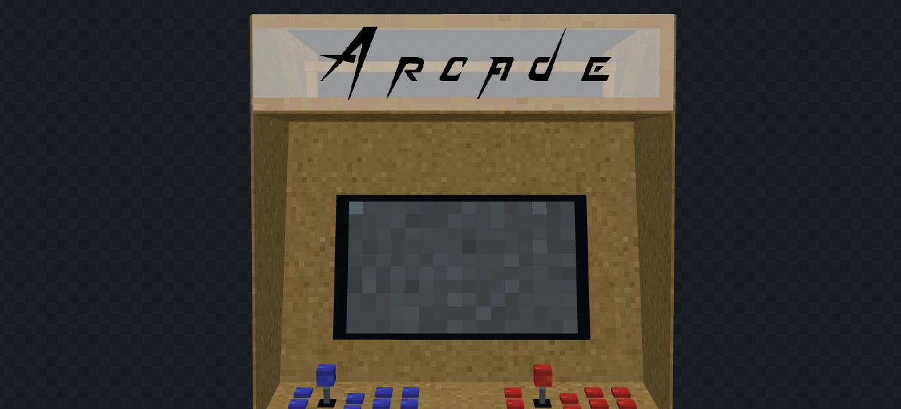