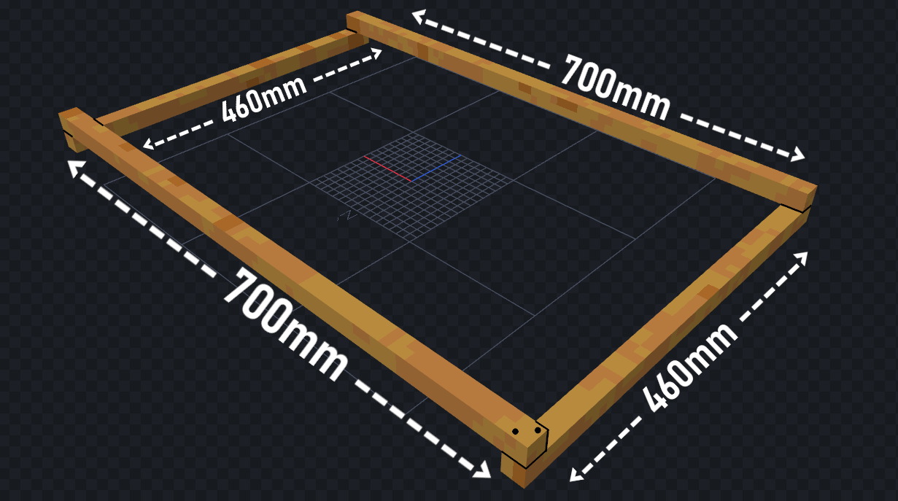
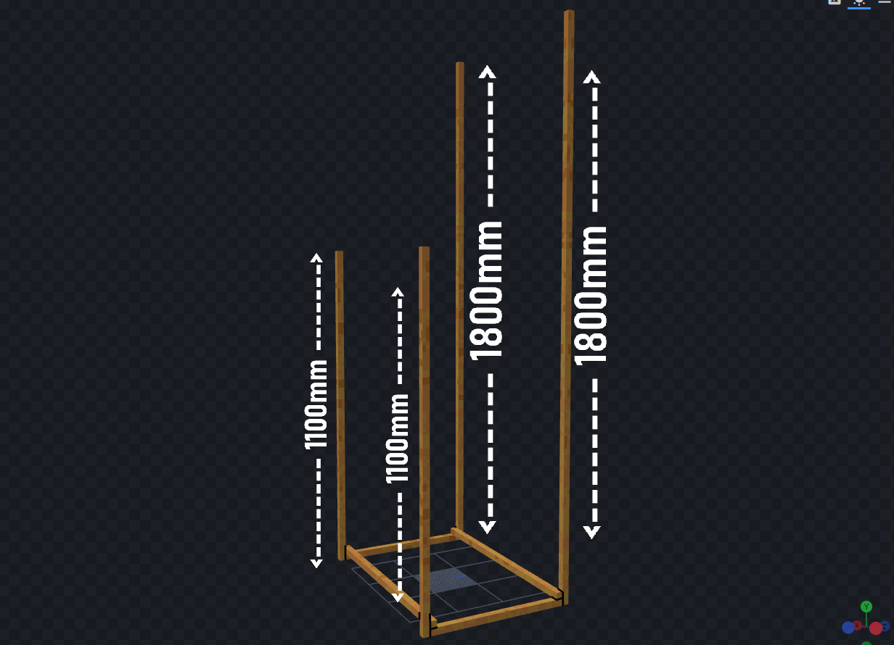
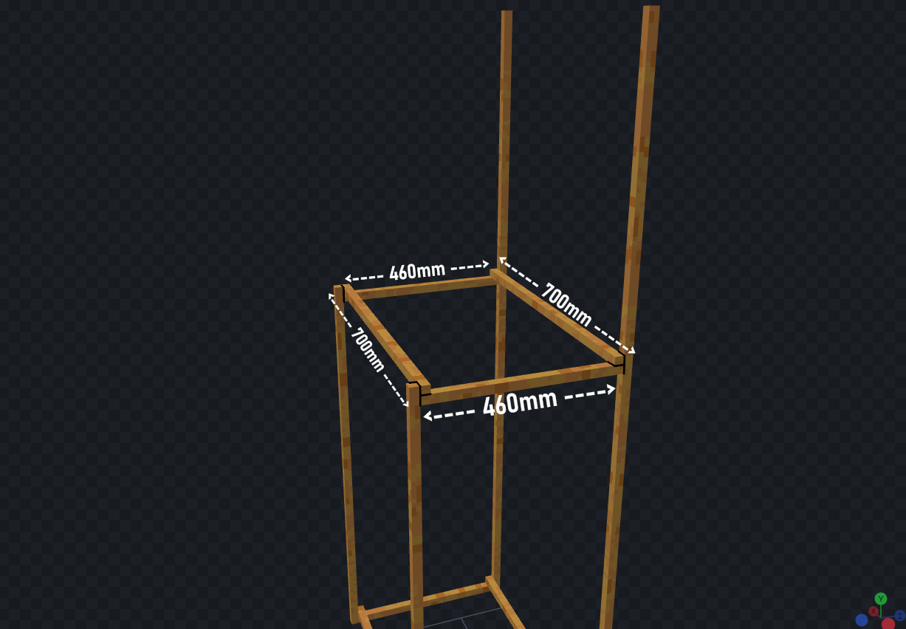
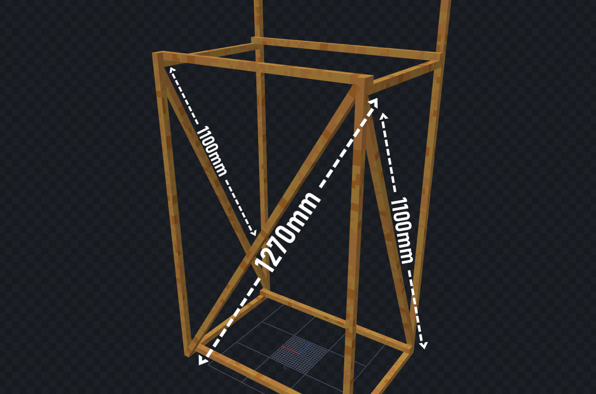
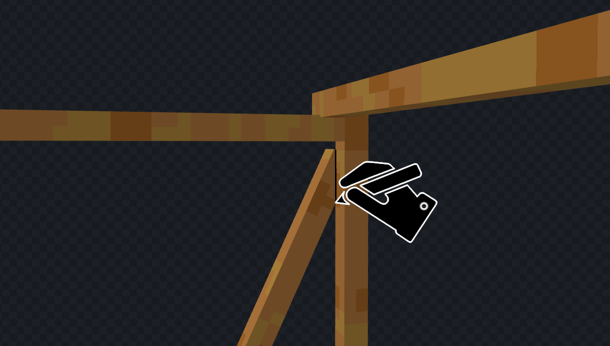

## Einführung
Ok, du hast also die benötigten Baumaterialien organisiert? Gut! Dann zeige ich dir nun, wie du das Grundgerüst deines Arcade Automaten aufziehst. Sprich alles vom Holzgestell bis zum Verkabeln der Komponennten. Solltest du bei Letzterem unsicher sein, kannst du dir das <a href="https://www.youtube.com/watch?v=dQw4w9WgXcQ" target="_blank">Tutorial zum Einrichten</a> des Automaten anschauen oder uns per <a href="https://github.com/HazDu/Arcader/issues/new?assignees=HazDu&labels=question&projects=&template=question.md&title=Question" target="_blank">GitHub issue template</a>
 für jegliche Fragen erreichen.

## 1. Grundgestell
Als erstes errichtest du das grundgestell, das mag etwas kompliziert wirken, jedoch sollte es mit der bereitgestellten Bildanleitung einfach sein.
Zusätzlich kannst du dir das Modell aus allen Winkeln auf <a href="https://sketchfab.com/3d-models/arcade-machine-wood-base-7800679fd0f54210a0e7d8027a0f3bdf" target="_blank">Sketchfab</a>
 ansehen.

### Schritt 1:
Zu erst baust du den Rahmen, der auf dem Boden steht. Kleiner tipp am Anfang: Verschraube jede Ecke mit zwei Schrauben(so wie im Bild gezeigt), um das gestell stabiler zu machen.

### Schritt 2:
Jetzt ziehst du den Kasten mal etwas in die Höhe. Dafür einfach in den vier Ecken die Latten festschrauben, wie im Bild zu erkennen ist. Damit hast du dann tatsächlich auch schon die Maximalhöhe des Automaten erreicht.

### Schritt 3:
Hier wiederholst du quasi einfach noch mal Schritt 1 nur weiter oben.

### Schritt 4:
Wenn du jetzt etwas an deinem Gestell wackelst, merkst du, dass es noch ziemlich nachgibt. Deshalb baust du jetzt einige diagonale Latten ein. Bevor du jetzt aber loslegst, scroll noch etwas nach unten und schau dir den [Tipp](https://arcader.hazdu.de/hardware/#Tipp-Schritt-4) an.

### Tipp Schritt 4:
Wenn du einen einfachen Weg brauchst, die Winkel an den Diagonalen zu messen, halte die Latte von außen an und mach innen einen Strich, genau so wie in der unteren Grafik.
