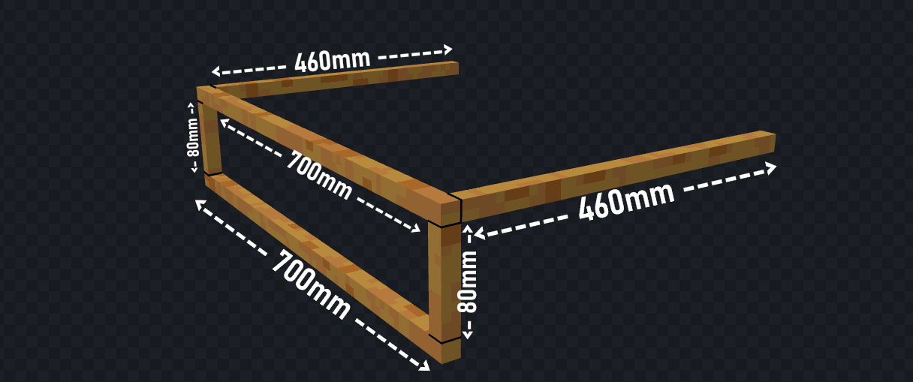
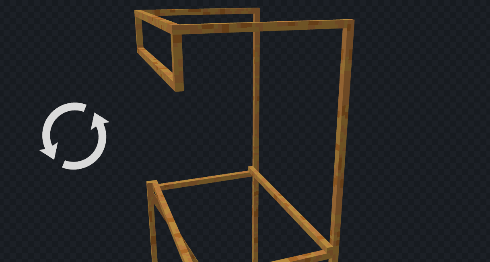
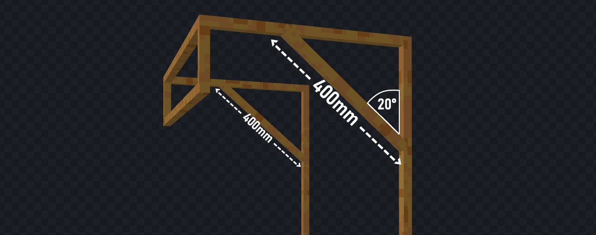
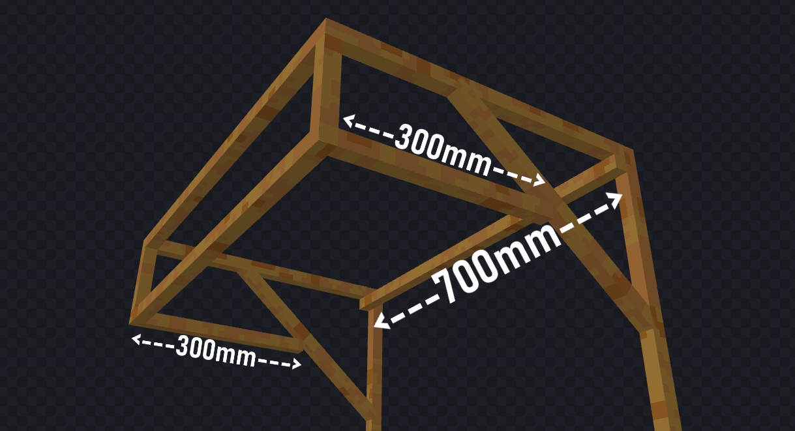
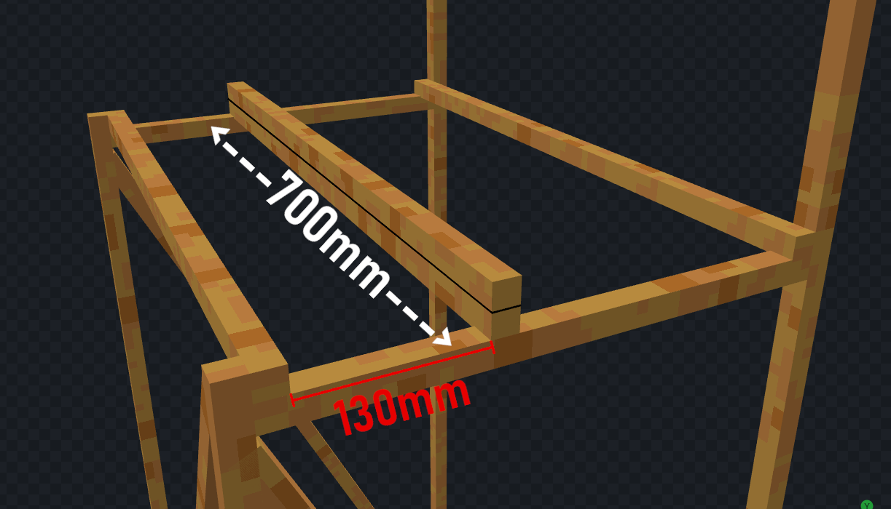
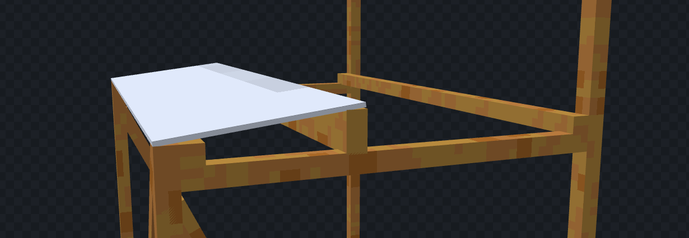
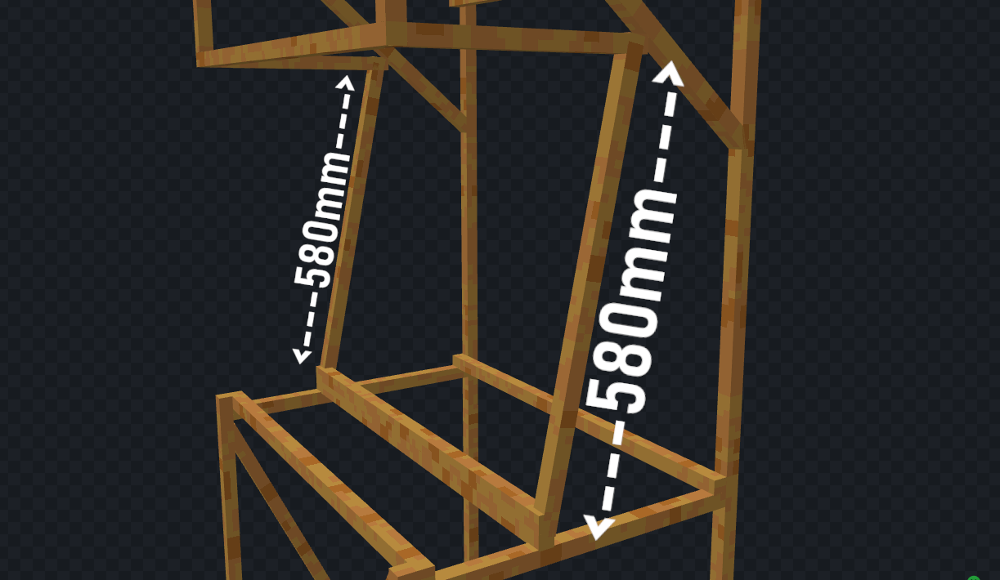
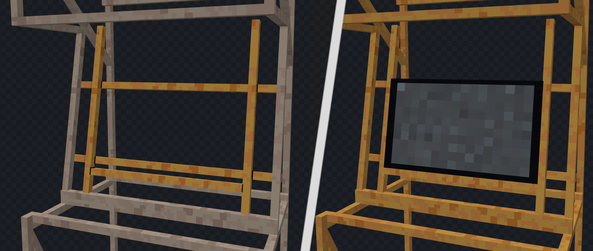

## Einführung
Ok, du hast also die benötigten Baumaterialien organisiert? Gut! Dann zeige ich dir nun, wie du das Grundgerüst deines Arcade Automaten aufziehst. Sprich alles vom Holzgestell bis zum Verkabeln der Komponennten. Solltest du bei Letzterem unsicher sein, kannst du dir das <a href="https://www.youtube.com/watch?v=dQw4w9WgXcQ" target="_blank">Tutorial zum Einrichten</a> des Automaten anschauen oder uns per <a href="https://github.com/HazDu/Arcader/issues/new?assignees=HazDu&labels=question&projects=&template=question.md&title=Question" target="_blank">GitHub issue template</a>
 für jegliche Fragen erreichen.

## 1. Grundgestell
Als erstes errichtest du das grundgestell, das mag etwas kompliziert wirken, jedoch sollte es mit der bereitgestellten Bildanleitung einfach sein.
Zusätzlich kannst du dir das Modell aus allen Winkeln auf <a href="https://sketchfab.com/3d-models/arcade-machine-wood-base-7800679fd0f54210a0e7d8027a0f3bdf" target="_blank">Sketchfab</a>
 ansehen.

### Schritt 1:
Zu erst baust du den Rahmen, der auf dem Boden steht. Kleiner tipp am Anfang: Verschraube jede Ecke mit zwei Schrauben(so wie im Bild gezeigt), um das gestell stabiler zu machen.

### Schritt 2:
Jetzt ziehst du den Kasten mal etwas in die Höhe. Dafür einfach in den vier Ecken die Latten festschrauben, wie im Bild zu erkennen ist. Damit hast du dann tatsächlich auch schon die Maximalhöhe des Automaten erreicht.

### Schritt 3:
Hier wiederholst du quasi einfach noch mal Schritt 1 nur weiter oben.

### Schritt 4:
Wenn du jetzt etwas an deinem Gestell wackelst, merkst du, dass es noch ziemlich nachgibt. Deshalb baust du jetzt einige diagonale Latten ein. Bevor du jetzt aber loslegst, scroll noch etwas nach unten und schau dir den [Tipp](https://arcader.hazdu.de/hardware/#tipp-schritt-4) an.

### Tipp Schritt 4:
Wenn du einen einfachen Weg brauchst, die Winkel an den Diagonalen zu messen, halte die Latte von außen an und mach innen einen Strich, genau so wie in der unteren Grafik.

### Schritt 5:
Nun stellst du dein Gestell erst mal bei seite. Jetzt wird nämlich der obere Teil gebaut. Diesen baust du am besten zunächst einzeln zusammen, da das Ganze sonst etwas wackelig wird.

### Schritt 6:
Für den nächsten Schritt legst du das Gestell am besten auf eine der beiden Seiten. Jetzt kannst du nämlich ganz einfach den vorher gebauten Teil anschrauben, ohne diesen dauernd halten zu müssen.

### Schritt 7:
Als nächstes verschraubst du zwei Latten diagonal über die soeben entstandenen Ecken. Hier ist der Winkel nicht allzu wichtig, in meinem Fall beträgt er circa 20°. Die Latten bringen Stabilität in den oberen Bereich und du kannst den Automaten danach wieder aufstellen.

### Schritt 8:
Um das obere Gebälge zu vervollständigen, kommt hinten noch eine Querstrebe hin und zwei kurze Latten verbinden die obere Front mit den Diagonalen aus dem letzten Schritt.

### Schritt 9:
Vielleicht siehst du schon wo später das Button Panel hin kommt. Dieses ist am besten licht angeschrägt. Um dies zu erreichen, mach dir das Leben leicht, indem du einfach zwei Latten übereinander befestigst, so wie im Bild zu sehen. Die rote Markierung zeigt dir, welchen Abstand du dabei beachten musst. Aber Obacht! Auch hier gibt es wieder einen [Tipp](https://arcader.hazdu.de/hardware/#tipp-schritt-9).

### Tipp Schritt 9:
Um sicher zu gehen ob der Abstand wirklich stimmt, kannst du zum Prüfen deine 700mm x 200mm Platte drüber legen und schauen ob sie an allen Ecken bündig aufliegt.

### Schritt 10:
Bisher sind die beiden Teile ja lediglich durch die zwei Latten hinten verbunden. Das änderst du jetzt! Dafür setzt du zwei Latte n wie gezeigt ein. Und für die Abschrägungen nicht vergessen, was du in [Tipp Schritt 4](https://arcader.hazdu.de/hardware/#tipp-schritt-4) gelernt hast.

### Schritt 11:
Hier musst du jetzt etwas improvisieren, da jeder Monitor einen etwas anderen Formfaktor hat. Also allgemein brauchst du eine Halterung für den Bildschirm. Im Bild siehst du eine mögliche Lösung, welche ich gewählt habe.
